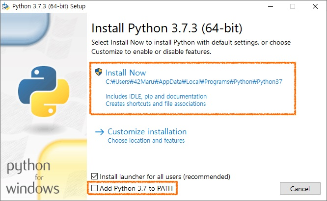

# Strabismus Recognizer 👀
본 프로그램은 디엔 인공지능 기반 사시진단 소프트웨어입니다.
  

## 1. 파이썬 설치
- 본 프로그램은 파이썬을 기반으로 작동합니다.
- 자신의 PC에 맞는 파이썬을 설치해주시길 바랍니다. 
- 내 컴퓨터를 마우스 우클릭 → 속성을 보면 몇 bit 컴퓨터인지 확인할 수 있습니다.

#### 주의 (WARNING) !!

- Add Python 3.7 to Path를 반드시 체크(V)하고 설치해야합니다. 
- 그렇지 않을 경우 직접 환경변수를 등록해야하는데 꽤 복잡합니다.
  

#### 설치 링크 
- 본 문서는 파이썬 버전 3.7.3을 기준으로 작성되었습니다.
- 위에서 말했듯이 Add Python 3.7 to Path를 꼭 체크(V) 해주세요!!
- 64비트 컴퓨터 : [설치 링크](https://www.python.org/ftp/python/3.7.3/python-3.7.3-amd64.exe)
- 32비트 컴퓨터 : [설치 링크](https://www.python.org/ftp/python/3.7.3/python-3.7.3.exe)
  

## 2. 사시진단 프로그램 설치
- 폴더에 동봉된 `install.bat`을 더블클릭하면 사시 진단 프로그램이 설치됩니다.
  

## 3. 서버 실행
- 폴더에 동봉된 `start_server.bat`을 더블클릭하면 사시 진단 서버가 실행됩니다. 
- 검정색 터미널 창은 계속 켜놔야합니다. (터미널 창을 닫으면 서버도 종료됩니다.)
  

#### 포트 변경을 원한다면 (Optional)
- 기본 포트는 8595로 지정되어있는데, 변경하고 싶을 때만 아래를 수행합니다. 
- 일반적으로 이 작업을 수행할 필요는 없습니다.
- `start_server.bat`을 우클릭하고 [편집]을 누른 뒤에 `cmd/k python application.py --port=8595`에서 port= 뒷부분에 원하는 포트를 적으면 됩니다.
  

## 4. 웹사이트 접속하기
- 크롬 등의 웹브라우저를 열고 `http://localhost:8595/` 를 입력하시면 웹사이트에 접속할 수 있습니다.
- 만약 포트번호를 변경하셨다면 :8595를 변경하신 포트로 변경하시면 접속할 수 있습니다.
